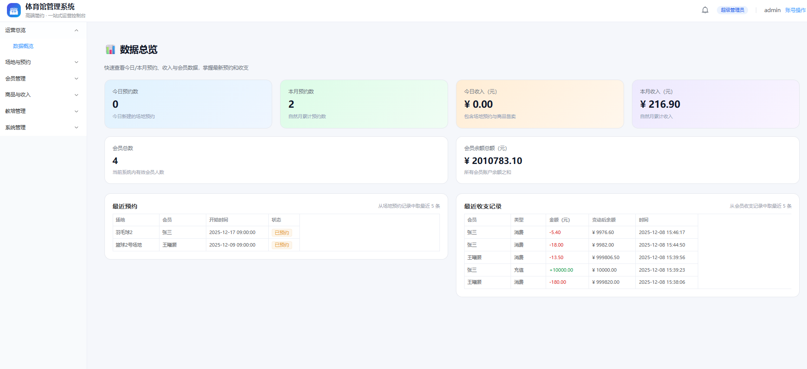
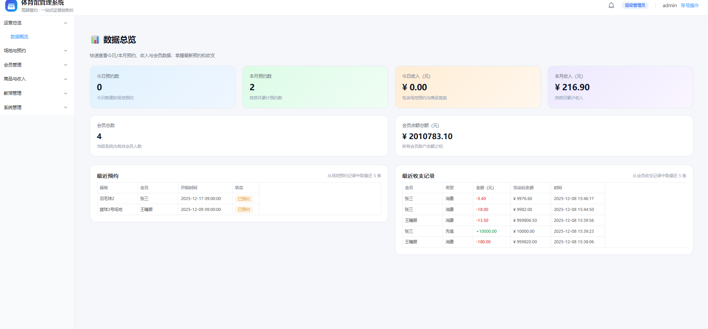

# 🏋️ 健身房智慧管理系统

  

## 📖 项目简介

一个完整的健身房管理系统，包含管理端和会员端。主要解决场地预约、会员管理、培训课程、商品售卖等日常运营需求，所有订单统一管理，支持多种会员卡类型和权限控制。

## ✨ 核心亮点

* **场地预约**：跨天预约、自动计算金额、会员卡折扣、取消退款
* **会员卡系统**：计次卡、时限卡、折扣卡，余额充值扣费
* **订单统一管理**：预约、课程、商品、退款订单集中处理
* **权限管理**：角色配置、菜单权限、按钮级控制
* **双端分离**：管理端和会员端独立运行，接口统一

## 📸 运行预览

### 会员端界面


### 管理端界面


## 🛠 技术栈

- **前端**: Vue3, TypeScript, Element Plus, Vite
- **后端**: Python 3.12, FastAPI, SQLAlchemy
- **数据库**: MySQL 8
- **部署**: 支持 Docker 容器化部署

## 🚀 快速启动

### 1. 克隆项目
```bash
git clone https://github.com/w13280070133/Smart-Stadium-Management-System.git
cd Smart-Stadium-Management-System
```

### 2. 数据库初始化
导入根目录的 `Dump20251123.sql` 到 MySQL，创建 `gym_v2` 数据库。

### 3. 后端启动
```bash
cd backend
python -m venv venv
venv\Scripts\activate          # Windows
# source venv/bin/activate     # Linux/Mac
pip install -r requirements.txt
uvicorn app.main:app --reload --host 0.0.0.0 --port 9000
```

### 4. 前端启动

**管理端**：
```bash
cd admin-frontend
npm install
npm run dev
```

**会员端**：
```bash
cd member-frontend
npm install
npm run dev
```

### 5. 一键启动（Windows）
直接运行 `start_gym_all.bat`，自动启动后端和两个前端。


## 🌐 访问地址

- 后端 API: http://localhost:9000
- 管理端: http://localhost:5173
- 会员端: http://localhost:5175

## 📂 项目结构

```
├── backend/              # 后端服务 (FastAPI + MySQL)
│   ├── app/
│   │   ├── routers/      # API 路由
│   │   ├── services/     # 业务逻辑
│   │   └── main.py       # 入口文件
│   └── venv/             # Python 虚拟环境
├── admin-frontend/       # 管理端前端 (Vue3 + Element Plus)
│   ├── src/
│   │   ├── views/        # 页面组件
│   │   ├── router/       # 路由配置
│   │   └── utils/        # 工具函数
│   └── package.json
├── member-frontend/      # 会员端前端 (Vue3 + Element Plus)
│   ├── src/
│   │   ├── views/        # 页面组件
│   │   └── router/       # 路由配置
│   └── package.json
├── start_gym_all.bat     # 一键启动脚本
└── 项目总览.md            # 详细开发文档
```

## 💡 主要功能模块

- **会员管理**：会员信息维护、会员卡办理（计次/时限/折扣）、余额充值与扣费
- **场地预约**：支持跨天预约、自动计价、会员折扣、取消退款
- **培训课程**：课程与班级管理、学员报名、退费处理
- **商品售卖**：商品管理、收银结算、退款与库存回冲
- **订单中心**：统一管理所有订单类型（预约/课程/商品/退款）
- **系统设置**：预约规则、培训规则、会员配置、角色权限、模块开关
- **员工管理**：员工账号管理、角色权限分配

## 📝 开发说明

- 后端接口主要在 `backend/app/routers/` 目录
- 管理端页面在 `admin-frontend/src/views/`
- 会员端页面在 `member-frontend/src/views/`
- 详细的业务逻辑和改动记录见 `项目总览.md`

## ⚙️ 环境要求

- Python 3.12+
- Node.js 16+
- MySQL 8.0+