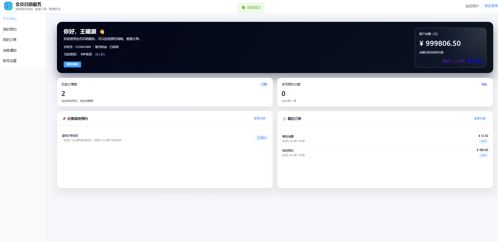

# 🏋️ 健身房智慧管理系统 (GymSystem V2)


一个功能完整的健身房/体育馆管理系统，采用前后端分离架构，包含**管理后台**和**会员端**两套前端应用。系统支持场地预约、会员管理、商品售卖、培训课程、订单管理等完整业务闭环，并集成了 AI 智能助手功能。

## 📸 界面预览

### 会员端


### 管理端


## ✨ 核心功能

### 🎾 场地预约
- 多场地类型支持（羽毛球、篮球、瑜伽等）
- 可视化日历预约，支持跨天预约
- 自动计算金额，支持会员折扣
- 取消预约自动退款

### 👥 会员管理
- 会员信息维护，支持等级体系
- 多种会员卡类型：计次卡、时限卡、折扣卡
- 账户余额充值与消费
- 完整的交易流水记录

### 📦 商品售卖
- 商品库存管理
- 收银结算，支持现金/会员余额支付
- 退款与库存自动回冲

### 📚 培训课程
- 教练与学员管理
- 课程班级编排
- 学员报名与签到
- 课时消耗与退费

### 📋 订单中心
- 统一管理所有订单类型（预约/课程/商品/退款）
- 完整的订单状态流转
- 支持多种支付方式

### 🤖 AI 智能助手
- 自然语言场地查询
- 智能预约推荐
- 规则咨询问答
- 流式对话交互

### ⚙️ 系统设置
- 预约规则配置（营业时间、提前天数、取消期限）
- 会员等级与折扣配置
- 角色权限管理（菜单权限 + 操作权限）
- 功能模块开关

## 🛠️ 技术架构

```
┌─────────────────────────────────────────────────────────────┐
│                         前端层                               │
│  ┌─────────────────────┐    ┌─────────────────────────┐    │
│  │   管理端 (5173)      │    │    会员端 (5175)         │    │
│  │   Vue3 + TS + Vite   │    │    Vue3 + TS + Vite     │    │
│  │   Element Plus       │    │    Element Plus         │    │
│  └─────────────────────┘    └─────────────────────────┘    │
└─────────────────────────────────────────────────────────────┘
                              │
                              ▼
┌─────────────────────────────────────────────────────────────┐
│                       后端 API (9000)                        │
│  ┌─────────────────────────────────────────────────────┐   │
│  │                  FastAPI + Python 3.12               │   │
│  │  ┌──────────────┐ ┌──────────────┐ ┌──────────────┐ │   │
│  │  │   Routers    │ │   Services   │ │   AI Agent   │ │   │
│  │  │   (API层)    │ │   (业务层)   │ │  (DeepSeek)  │ │   │
│  │  └──────────────┘ └──────────────┘ └──────────────┘ │   │
│  └─────────────────────────────────────────────────────┘   │
└─────────────────────────────────────────────────────────────┘
                              │
                              ▼
┌─────────────────────────────────────────────────────────────┐
│                       MySQL 8.0                              │
│         原生 SQL + 连接池 + 事务管理 + 参数化查询            │
└─────────────────────────────────────────────────────────────┘
```

### 技术选型

| 层级 | 技术栈 |
|------|--------|
| 管理端前端 | Vue 3.4 + TypeScript 5 + Vite 5 + Element Plus 2 |
| 会员端前端 | Vue 3.4 + TypeScript 5 + Vite 5 + Element Plus 2 |
| 后端框架 | FastAPI 0.115 + Python 3.12 |
| 数据库 | MySQL 8.0 + 原生 SQL（无 ORM） |
| 认证授权 | JWT + PBKDF2-SHA256 密码哈希 |
| AI 能力 | DeepSeek API + Function Calling |

## 🚀 快速开始

### 环境要求

- Python 3.12+
- Node.js 18+
- MySQL 8.0+

### 1. 克隆项目

```bash
git clone https://github.com/yourusername/GymSystemV2.git
cd GymSystemV2
```

### 2. 数据库配置

```bash
# 1. 创建数据库
mysql -u root -p -e "CREATE DATABASE gym_v2 CHARACTER SET utf8mb4 COLLATE utf8mb4_unicode_ci;"

# 2. 导入初始数据（如有）
mysql -u root -p gym_v2 < Dump20251123.sql
```

### 3. 后端启动

```bash
cd backend

# 创建虚拟环境
python -m venv venv
venv\Scripts\activate          # Windows
# source venv/bin/activate     # Linux/Mac

# 安装依赖
pip install -r requirements.txt

# 配置环境变量（创建 .env 文件）
echo SECRET_KEY=your-secret-key-here > .env
echo DB_PASSWORD=your-db-password >> .env
echo DEEPSEEK_API_KEY=your-api-key >> .env  # 可选，用于 AI 功能

# 启动服务
uvicorn app.main:app --reload --host 0.0.0.0 --port 9000
```

### 4. 前端启动

**管理端：**
```bash
cd admin-frontend
npm install
npm run dev
# 访问 http://localhost:5173
```

**会员端：**
```bash
cd member-frontend
npm install
npm run dev
# 访问 http://localhost:5175
```

### 5. 一键启动（Windows）

```bash
# 直接双击运行
start_gym_all.bat
```

## 📂 项目结构

```
GymSystemV2/
├── backend/                    # 后端服务
│   ├── app/
│   │   ├── routers/           # API 路由层
│   │   │   ├── auth.py        # 管理端认证
│   │   │   ├── member_auth.py # 会员端认证
│   │   │   ├── courts.py      # 场地管理
│   │   │   ├── court_reservations.py  # 场地预约
│   │   │   ├── members.py     # 会员管理
│   │   │   ├── products.py    # 商品管理
│   │   │   ├── orders.py      # 订单管理
│   │   │   └── ...
│   │   ├── services/          # 业务逻辑层
│   │   │   ├── orders.py      # 订单服务
│   │   │   ├── cards.py       # 会员卡服务
│   │   │   └── ...
│   │   ├── agent/             # AI Agent 模块
│   │   │   ├── core.py        # Agent 核心逻辑
│   │   │   └── tools.py       # Agent 工具函数
│   │   ├── config.py          # 配置管理
│   │   ├── database.py        # 数据库连接池
│   │   ├── security.py        # 安全认证
│   │   ├── deps.py            # 依赖注入
│   │   └── main.py            # 应用入口
│   └── tests/                 # 单元测试
│
├── admin-frontend/            # 管理端前端
│   ├── src/
│   │   ├── views/             # 页面组件
│   │   ├── router/            # 路由配置
│   │   ├── stores/            # Pinia 状态管理
│   │   ├── utils/             # 工具函数
│   │   └── theme/             # 主题样式
│   └── package.json
│
├── member-frontend/           # 会员端前端
│   ├── src/
│   │   ├── views/             # 页面组件
│   │   ├── components/        # 公共组件
│   │   ├── router/            # 路由配置
│   │   └── utils/             # 工具函数
│   └── package.json
│
├── assets/                    # 静态资源（截图等）
├── 数据库表结构.md             # 数据库设计文档
├── start_gym_all.bat          # Windows 一键启动脚本
└── README.md
```

## 🔐 权限设计

系统采用 RBAC（基于角色的访问控制）模型：

| 角色 | 说明 | 权限范围 |
|------|------|----------|
| super_admin | 超级管理员 | 全部功能 |
| admin | 管理员 | 员工管理、系统设置 |
| operator | 操作员 | 日常业务操作 |
| viewer | 查看员 | 只读权限 |

## 📖 API 文档

启动后端后访问：
- Swagger UI: http://localhost:9000/docs
- ReDoc: http://localhost:9000/redoc

## 🧪 运行测试

```bash
cd backend
python -m pytest tests/ -v
```

## 📄 开源协议

MIT License

## 🤝 贡献指南

1. Fork 本仓库
2. 创建特性分支 (`git checkout -b feature/AmazingFeature`)
3. 提交更改 (`git commit -m 'Add some AmazingFeature'`)
4. 推送到分支 (`git push origin feature/AmazingFeature`)
5. 发起 Pull Request
